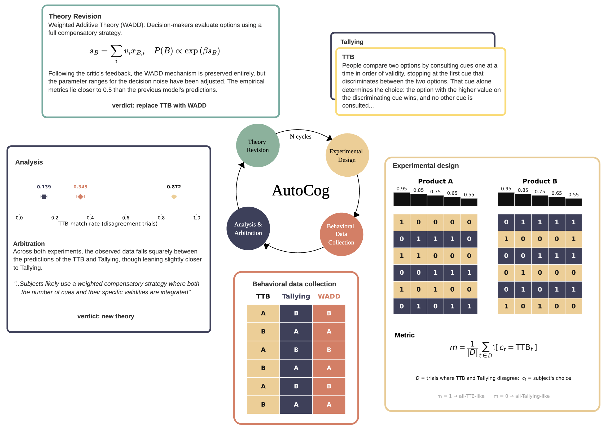

[](https://arxiv.org/abs/2606.26448) 


# AutoCog

This repository contains the code for the project Closing the Loop to Discover Psychological Theories with an Automated Cognitive Scientist

<p align="center">
  
</p>

**Automated cognitive scientist — an adversarial theory-debate framework.** The
researcher provides two seed theories (and their executable model
instantiations). Each theory is owned by an LLM agent that steelmans the
opponent, proposes an experiment plus a computable metric where its own model
should win, validates the design on simulated data, runs it on (real or
simulated) humans, and interprets the results. An arbiter then picks a winner
and guides synthesis of a new theory. Repeat for N rounds.

> This is **research code**. The priority is accuracy and readability over
> performance.

---

## 1. Get the code (with submodule)

`vendor/sweetbean` is a git submodule, needed only for the online (Firebase +
Prolific) experiments. Clone with it, or initialise after the fact:

```bash
git clone --recurse-submodules <repo-url>
# or, in an existing clone:
git submodule update --init --recursive
```

## 2. Environment

Python `>=3.11`. The project is managed with **`uv`**:

```bash
uv sync                              # core deps from pyproject.toml + uv.lock
uv pip install -r requirements.txt   # adds anthropic, openai, torch, autora* (git)
```

`uv sync` alone is **not enough** — `requirements.txt` carries the LLM SDKs and
the AutoRA stack (and pulls in `matplotlib`/`scikit-learn` transitively). The
`git+https` deps in `requirements.txt` (`auto-prompt`, `sweetbean`, `autora*`)
track their `@main` branch; re-run that command to pull newer upstream commits.

Everything is run **from the repository root** — that is what puts `src.*` and
`scripts.*` on the import path.

> **Note on `pip install -e .`:** it does *not* give you an importable
> `autocog` package. The framework lives in `src/` and is imported as `src.*`.
> The package declaration in `pyproject.toml` is aspirational, not
> load-bearing.

## 3. Secrets (API keys)

LLM calls read keys from a `.env` file at the repo root (loaded via
`python-dotenv`). It is git-ignored, so it never ships with the repo — create
it yourself:

```bash
GEMINI_API_KEY=...      # default provider (google-genai also accepts GOOGLE_API_KEY)
ANTHROPIC_API_KEY=...   # provider=anthropic
OPENAI_API_KEY=...      # provider=openai
# AI_SANDBOX_KEY=...    # only for provider=princeton (Princeton AI Sandbox)
```

Supported providers: `gemini` (default), `anthropic`, `openai`, `princeton`,
`mock` (see [src/llm.py](src/llm.py)).

> **`--llm_provider mock` is NOT an offline dry run.** `MockClient` is a
> unit-test fixture that replays a caller-supplied list of canned responses;
> `make_client` constructs it with an *empty* list, so it raises
> `MockClient exhausted canned responses` on the first LLM call. Separately,
> `AutoCog.from_yaml` builds its client eagerly from `configs/default.yaml`
> before the CLI provider is applied, so a keyless run fails there first.
> **Running the discovery loop requires a real API key.** The mock provider is
> useful only inside the test suite, which supplies its own canned responses.
> Everything under [§7](#7-regenerating-the-analyses) runs offline, because it
> reads the committed `results/` tree instead of calling an LLM.

## 4. Run the tests

Tests live in `tests/` and add the repo root to `sys.path` via
[tests/conftest.py](tests/conftest.py), so run `pytest` **from the repo root**:

```bash
uv run pytest -q                              # full suite
uv run pytest -q tests/test_jsd.py            # one file
uv run pytest -q -k recovery                  # by keyword
```

Most tests are offline unit tests; a few integration tests
(`test_anthropic_client.py`, …) need API keys and network.

[tests/test_entry_points_importable.py](tests/test_entry_points_importable.py)
is the "is this repo runnable" guard. It imports every `main*.py` and
`scripts/**.py` in a **subprocess**, reproducing `python scripts/foo.py`
exactly — the script's own directory on `sys.path[0]`, not the repo root — so a
script that forgets its `sys.path` bootstrap cannot pass by accident. Entry
points that genuinely cannot import in a plain checkout are listed in that
file's `UNAVAILABLE` map, each pinned to the reason it fails, so the exclusion
list cannot silently rot.

## 5. Run the framework

Entry points are the root `main*.py` scripts (argparse-driven, run from root):

| Script | Domain / purpose |
| --- | --- |
| `main_decision_making_binary.py` | decision making, binary cues — the main pipeline |
| `main_ablation_binary.py` | same, plus the Stage-0 ablations & controls |
| `main_heuristic_decision_making.py` | heuristic decision making (graded / cardinal cues) |
| `main_*_online.py` | live online variants (Firebase + Prolific) |

These all consume tokens — there is no free dry-run mode (see the note in
[§3](#3-secrets-api-keys)). Start with `--n_rounds 1` to check the wiring
cheaply before committing to a full five-cycle run.

```bash
# Smallest real run: one cycle. Default provider gemini / gemini-3.1-pro-preview.
uv run python main_decision_making_binary.py \
  --ground_truth ttb_sampling --n_rounds 1

# One ablation condition, one cycle
uv run python main_ablation_binary.py \
  --condition baseline --ground_truth ttb_sampling --n_rounds 1

# The full five-cycle run used in the paper
uv run python main_ablation_binary.py \
  --condition baseline --ground_truth ttb_sampling --n_rounds 5
```

To check that every *analysis* still runs without spending anything:

```bash
bash scripts/smoke_analyses.sh          # all groups, ~2 min
bash scripts/smoke_analyses.sh fig3     # one group
```

Key `main_ablation_binary.py` flags:
`--condition {baseline,jsd_metric,neutral_proposer,blind_design}`,
`--ground_truth` (canonical `*_sampling` theories + non-canonical stress-test
baselines), `--n_rounds`, `--gt_epsilon`/`--gt_seed` (ground-truth action
noise), `--design_seed` (blind_design), `--run_id`, `--out_path`. Run any
script with `-h` for the full list.

### Batch wrappers (`scripts/run_*.sh`)

`run_ablation_smoke.sh`, `run_blind_design.sh`, `run_online_*.sh`, etc. sweep
ground truths × seeds, write one log per run under `logs/`, and call a
summary/scoring script at the end (e.g. `score_blind_design.sh` →
`scripts/recovery_correlation.py`).

> **Gotcha for fresh clones / cloud agents:** these scripts begin with
> `source /Users/aj9225/Local/autograd/.autograd-gecco/bin/activate`, a
> machine-specific venv path. Edit that line to `source .venv/bin/activate` (or
> your venv) before running them anywhere else. Most accept `LLM_PROVIDER=mock`
> for a free harness check.

## 6. Repository map

```text
main*.py                 entry points (run from repo root)
src/                     the framework (imported as src.*)
  autocog.py               AutoCog orchestrator (the debate loop)
  theory.py, theory_generator.py, improver.py, arbiter.py
  llm.py                   provider clients (gemini/anthropic/openai/princeton/mock)
  controls.py, ablations.py, jsd.py   control / ablation variants & the JSD metric
  experiment.py, observation.py, metric.py, feedback.py
  decision_making_binary_features/  heuristic_decision_making/
  prompts/                 prompt templates
theories/heuristic_decision_making/   seed + ground-truth theory YAMLs
configs/                 LLM/run configs (default.yaml, mock.yaml, jsd_threshold.json)
scripts/                 analysis & plotting (plot_*.py, recovery_*.py, eval_*.py)
  preregistration/         the preregistered follow-up study (build / run / analyse)
  run_*.sh / score_*.sh    batch sweep + scoring wrappers
  smoke_analyses.sh        runs every reported analysis (see §7)
tests/                   pytest suite (conftest puts the repo root on sys.path)
results/                 committed run outputs (see below)
logs/                    per-run logs (git-ignored)
vendor/sweetbean         git submodule
```

### The `results/` tree

Run outputs are **committed**, so the paper's figures can be regenerated
without re-running the (expensive, non-deterministic) LLM loop:

```text
results/recovery/                        synthetic ground-truth recovery, binary cues
                                           <family>/noise=<eps>/dmb_ground_truth_*_run<N>/
  analysis/                                derived tables + figures (recovery_long.csv,
                                           per_model/, llmasjudge/) that stats.py reads
results/human_decision_making_binary/    closed-loop run with humans, binary  (ttb+wadd)
results/human_decision_making_cardinal/  closed-loop run with humans, cardinal (ttb+tallying)
results/controls/                        ablations & controls (ablation_stage0, proposer_comparison,
                                           condition_blind_design, seed_gt_control, random, …)
results/preregistration/                 preregistered follow-up study data + figures
results/hilbig2014/                      Hilbig & Moshagen (2014) human dataset (exp1.txt)
results/stats/                           every number quoted in the paper, in one
                                           table (output of scripts/stats.py)
```

Inside a run directory, `pi_1` and `pi_2` are the two theory slots and
`theory_generator_pi_N` the generated replacements. **Those names are on-disk
data** — the analysis scripts glob for them — so they were deliberately left
unchanged when the `AutoPi` class was renamed to `AutoCog`.

## 7. Regenerating the analyses

Every reported analysis runs off the committed `results/` tree, so the paper's
figures can be regenerated without re-running the LLM loop:

```bash
# Figure 3A — recovery of the canonical strategies (Pearson r / MSE / autocorr).
# The defaults are the reported configuration: results/recovery, the three
# canonical *_sampling families, at epsilon in {0.0, 0.5, 0.75}.
uv run python scripts/recovery_correlation.py

# Figure 3A — per-family recovery panels
uv run python scripts/plot_recovery_per_model.py \
  --families ttb_sampling wadd_sampling tallying_sampling --noises 0.0 0.5 0.75

# Figure 3B — mechanism similarity vs action noise (LLM judge, 0-1).
# --max-noise 0.75 restricts to the three reported levels (N=30 theories each);
# without it the plot gains an unreported epsilon=1.0 point.
uv run python scripts/plot_similarity.py --max-noise 0.75

# Figures 4-5 — theory lineage + leaderboard for the human runs
uv run python scripts/plot_autocog_convergence.py

# Figure 4G-J — generalisation to Hilbig & Moshagen (2014)
uv run python scripts/eval_hilbig.py --run-dir results/human_decision_making_binary/ttb+wadd

# Every number quoted in the paper, as one table -> results/stats/
uv run python scripts/stats.py
```

`scripts/stats.py` collects each reported quantity (value, SEM, n, source) into
`results/stats/stats_results.csv` plus a rendered `stats_summary.{png,pdf}`. It
reads the derived tables under `results/recovery/analysis/`, so run
`recovery_correlation.py` and `plot_recovery_per_model.py` first if those are
stale.

`results/recovery/` also holds `noise=1.0` runs. That is not a reported noise
level — it is the source of the synthetic `random` family baseline, which
`recovery_correlation.py` pulls in on its own.

Most scripts write into an `analysis/` subdirectory of the tree they read;
pass `-h` for the flags.

### Checking that every analysis still runs

```bash
bash scripts/smoke_analyses.sh            # every group, ~4 min
bash scripts/smoke_analyses.sh fig3       # fig1 | fig3 | fig4 | fig5 | si | loop
KEEP=1 bash scripts/smoke_analyses.sh     # keep the outputs to eyeball
```

One analysis per reported result, at deliberately tiny sample sizes: it checks
that each script can still find its inputs and run to completion, **not** that
it reproduces the paper's numbers. Exit status is non-zero if any analysis
fails, and anything that cannot run here is reported as an explicit `SKIP` with
its reason (missing credentials or uncommitted raw data) so a gap never reads as
coverage.

**It does not modify `results/`.** That tree is the paper's record. Every
analysis writes into a temp directory where it accepts an output flag; a few
hardcode a path inside `results/`, so the script snapshots git's view of
`results/` up front and reverts exactly what the run touched on exit. It
reverts only paths that changed *during* the run, leaving pre-existing local
edits alone.

## 8. Scope

AutoCog covers **multi-attribute decision making**. The category-learning
domain (GCM / RULEX / SUSTAIN on the Shepard I–VI structures) and the Centaur
simulated-participant backend belonged to the earlier `autopi` prototype and
are deliberately **not** part of this repository;
[tests/test_no_category_learning.py](tests/test_no_category_learning.py) keeps
them from creeping back in.

The LLM-as-judge analysis is **mechanism similarity only** — a continuous
score in [0, 1] from `scripts/judge_similarity.py`, plotted by
`scripts/plot_similarity.py`. The earlier binary family/algorithm-match rubric
(`judge_runs.py` and its plots) is not reported in the paper and has been
removed. Historical `judge_results*.csv` files still sit under `results/`.

## 9. Conventions

- **Run from the repo root** so `src.*` and the seed YAMLs resolve.
- **Don't commit on the maintainer's behalf** — propose changes for review (see
  [.claude/CLAUDE.md](.claude/CLAUDE.md)).
- **TDD with analytical tests**: prefer tests against a known closed-form value
  over ordering/sanity bounds.
- Python style: `snake_case` functions, `PascalCase` classes,
  `UPPER_SNAKE_CASE` constants. Plotting entry points are named `plot_*.py`.
- **Check the logs** under `logs/` after any batch run before trusting results.
